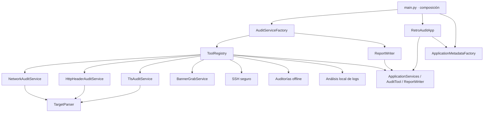

# Arquitectura de Retro Audit

## Objetivos

- Herramientas independientes de la interfaz y del punto de entrada.
- Extensión mediante registro, sin modificar el despachador de la UI.
- Dependencias creadas exclusivamente mediante `AuditServiceFactory`.
- Operaciones defensivas, acotadas y observables.

## Capas

## Reglas de dependencia

1. `main.py` sólo compone y arranca la aplicación.
2. `ui/` depende de protocolos en `contracts.py`, nunca de herramientas concretas.
3. `tools/` depende de contratos y validación, nunca de Textual.
4. `factory.py` es el único módulo que conoce todas las implementaciones concretas.
5. `reporting.py` no conoce la UI ni las herramientas.
6. `metadata.py` es la fuente única de identidad, licencia, enlaces y versiones mostradas por la UI.

## Arranque visual

`SplashConfig` concentra duración, intervalo, versión y preferencias de accesibilidad. `UiScreenFactory` crea `RetroSplashScreen`, mientras `RetroAuditApp` sólo decide cuándo mostrarla. La animación usa timers de Textual, nunca esperas bloqueantes, y detiene sus timers al desmontarse. Las variables `RETRO_AUDIT_SKIP_SPLASH` y `RETRO_AUDIT_REDUCED_MOTION` permiten automatización y movimiento reducido.

## Metadata y ayuda

`ApplicationMetadataFactory` construye el valor inmutable `AboutInfo` desde constantes verificadas, la versión del proyecto y las distribuciones instaladas. `UiScreenFactory` inyecta ese valor en `AboutWindow`; la ventana sólo presenta contenido y no consulta el entorno. El splash usa la misma fábrica de metadata para evitar versiones divergentes.

El botón **Ayuda** abre primero `CommanderMenu`. Su callback navega a la guía, al replay del splash o a `AboutWindow` después de cerrar el menú, evitando apilar modales durante una transición.

## Extensión

Una herramienta nueva implementa `AuditTool` (`tool_id`, `display_name`, `shortcut`, `guide`, políticas de objetivo/autorización, `input_fields` y `execute`) y se registra en `AuditServiceFactory.create_tool_registry()`. El catálogo, el menú, los formularios, la guía y el worker genérico la descubren automáticamente. `ToolField` describe entradas y `ToolGuide` contiene propósito, pasos, salida y límites de seguridad; las herramientas nunca importan Textual.

## Concurrencia

La UI admite una sola auditoría activa. El worker Textual es exclusivo, los controles quedan deshabilitados durante la operación y una excepción de herramienta se convierte en un resultado controlado para restaurar siempre la interfaz.
